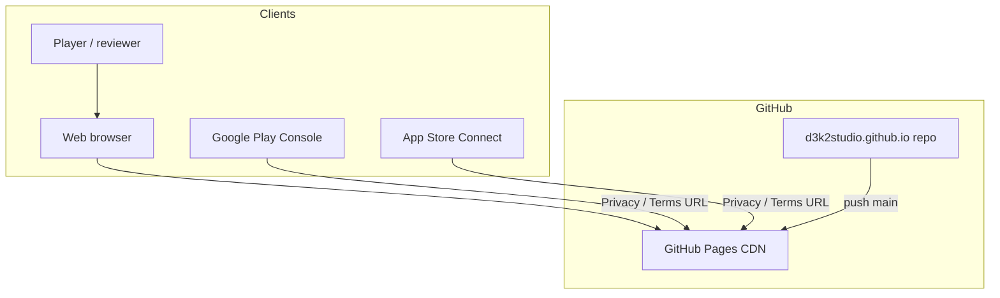
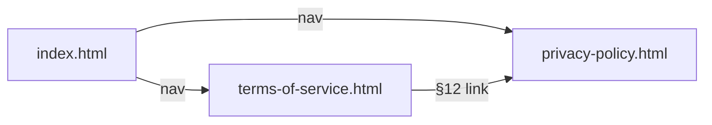
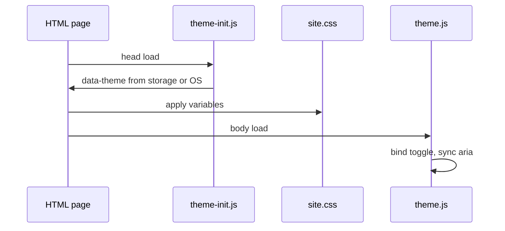

# Architecture overview

## System context

## Page map

## Runtime (browser)

No server-side logic. All state is client `localStorage` or OS preference.

## Asset dependencies

| Page | CSS | theme-init | theme.js | lang.js |
|------|-----|--------------|----------|---------|
| index.html | yes | yes | yes | yes |
| privacy-policy.html | yes | yes | yes | no |
| terms-of-service.html | yes | yes | yes | no |

## Deployment model

- **Single branch** (`main`) → root folder published as site
- **No build artifact** — HTML in repo is what users receive
- **Cache:** GitHub CDN; hard refresh after deploy if changes not visible

See [DEV_GUIDE.md](DEV_GUIDE.md) for file-level detail.
