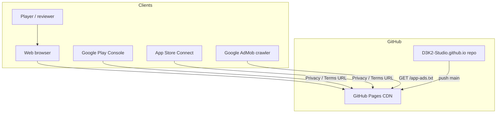
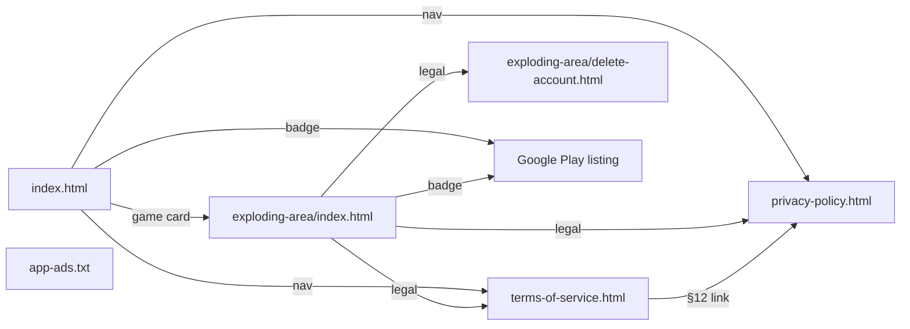
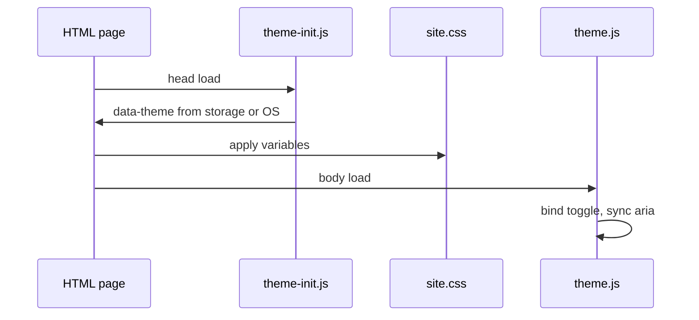

# Architecture overview

## System context

## Page map

Root static files also include **`app-ads.txt`** (AdMob IAB authorization; not linked from nav). See [CONTENT.md](CONTENT.md#admob-app-adstxt).

Play Store listing: `https://play.google.com/store/apps/details?id=com.d3k2studio.explodingarena` (brand **Exploding Arena**; site path remains `/exploding-area/`).

## Runtime (browser)

No server-side logic. All state is client `localStorage` or OS preference.

## Asset dependencies

| Page | CSS | theme-init | theme.js | lang.js | Play badge | Game icon |
|------|-----|--------------|----------|---------|------------|-----------|
| index.html | yes | yes | yes | yes | yes | no |
| exploding-area/index.html | yes | yes | yes | yes | yes | yes (app header + favicon) |
| exploding-area/credits.html | yes | yes | yes | yes | no | no |
| exploding-area/delete-account.html | yes | yes | yes | no | no | no |
| privacy-policy.html | yes | yes | yes | no | no | no |
| terms-of-service.html | yes | yes | yes | no | no | no |

Game landing (`exploding-area/index.html`) uses a Play Store–style app header (icon squircle, studio line, **3+** age badge, Install-position store CTA). See [CONTENT.md](CONTENT.md#exploding-arena-landing-play-store-style-header). Site header logo remains `d3k2-studio-logo.png` on every page.

## Deployment model

- **Single branch** (`main`) → root folder published as site
- **No build artifact** — HTML in repo is what users receive
- **Cache:** GitHub CDN; hard refresh after deploy if changes not visible

See [DEV_GUIDE.md](DEV_GUIDE.md) for file-level detail.
